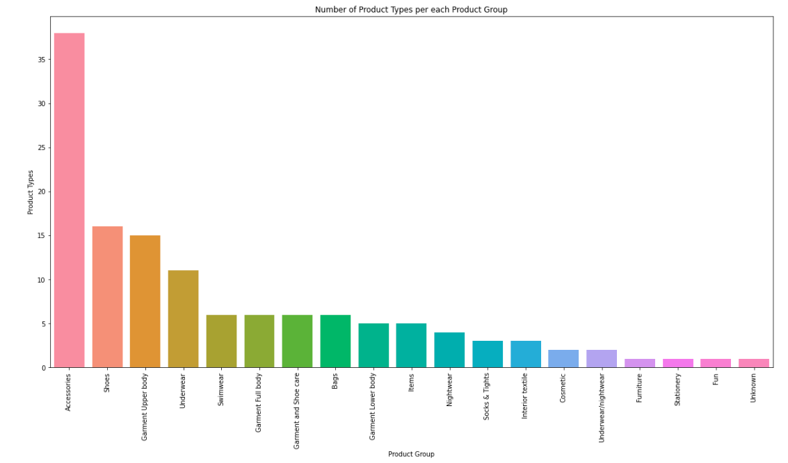
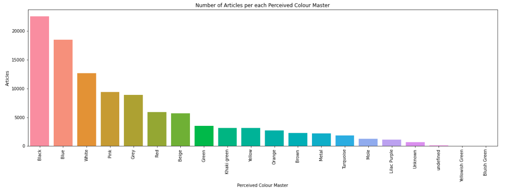
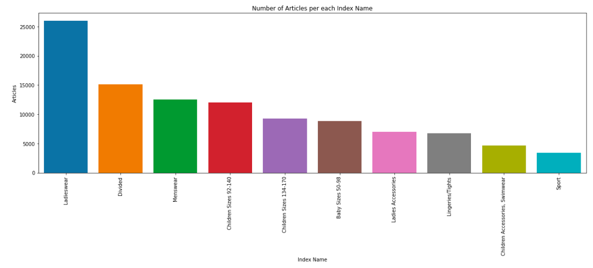

## Articles

El dataset d'articles conté informació sobre cada un dels productes disponible per a la compra. En particular, per a cada article hi ha la següent informació:

| article_id                     | Identificador de l'article                                                        |
| product_code                   | Codi identificatiu de l'article                                                   |
| prod_name                      | Nom de l'article                                                                  |
| product_type_no                | Codi identificatiu del tipus de producte                                          |
| product_type_name              | Nom del tipus del producte                                                        |
| product_group_name             | Nom del grup del producte                                                         |
| graphical_appearance_no        | Codi identificatiu de l'aparença gràfica                                          |
| graphical_appearance_name      | Nom de l'aparença gràfica                                                         |
| colour_group_code              | Codi identificatiu del color del producte                                         |
| colour_group_name              | Nom del color del producte                                                        |
| perceived_colour_value_id      | Codi identificatiu del grup de color del producte                                 |
| perceived_colour_value_name    | Nom del grup de color del producte                                                |
| perceived_colour_master_id     | Codi identificatiu del *colour master* del producte                               |
| perceived_colour_master_name   | Nom del *colour master* del producte                                              |
| department_no                  | Codi identificatiu del departament de l'article                                   |
| department_name                | Nom del departament de l'article                                                  |
| index_code                     | Codi identificatiu de l'índex de l'article                                        |
| index_name                     | Nom de l'índex de l'article                                                       |
| index_group_no                 | Codi identificatiu del grup d'índex del producte                                  |
| index_group_name               | Nom del grup d'índex del producte                                                 |
| section_no                     | Codi identificatiu de la secció del producte                                      |
| section_name                   | Nom de la secció del producte                                                     |
| garment_group_no               | Codi identificatiu del grup de peces de l'article                                 |
| garment_group_name             | Nom identificatiu del grup de peces de l'article                                  |
| detail_desc                    | Descripció de l'article                                                           |

Observem que moltes de les variables estan repetides, és a dir, hi ha la mateixa informació de dues maneres diferents (amb el codi identificatiu i amb el nom), pel que hem decidit treballar únicament amb el codi.

Veiem gràficament un petit resum de com són les dades a estudiar.

En primer lloc, representem el nombre d'articles per cada tipus de producte:

A continuació, veiem el nombre d'articles per color:

Per últim, representem el nombre d'articles per secció o departament:

