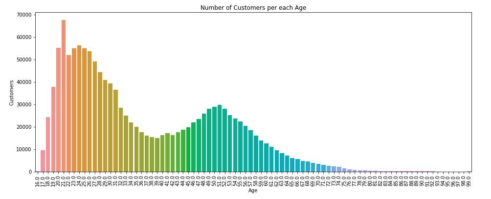

## Clients

El dataset de clients conté informació sobre cada un dels clients. En particular, per a cada consumidor hi ha la següent informació:

| customer_id             | Identificador del client                                                          |
| FN                      | Informació sobre si el client rep *Fashion News*                                  |
| Active                  | Informació sobre si el client rep comunicació de les revistes de moda             |
| club_member_status      | Informació sobre l'estat del *Club Member Status*                                 |
| fashion_news_frequency  | Informació sobre la freqüència en la que el client mira les notícies de moda      |
| age                     | Edat del client                                                                   |
| postal_code             | Codi postal del client                                                            |

En aquest cas, totes les variables contenen valors nuls, excepte el customer_id i el postal_code. Per a tractar aquests valors, les transformacions realitzades no són rellevants, però considerem interessant esmentar-les. 

Pel que fa a l'edat, el que s'ha fet es substituir els valors nuls per la mediana de la resta de valors. En canvi, pel que fa a les variables categòriques, és a dir la resta de variables, hem afegit un nou valor significatiu.

De l'anàlisi de les dades realitzat, en destaquem el següent gràfic, que mostra el nombre de clients per cada edat:

