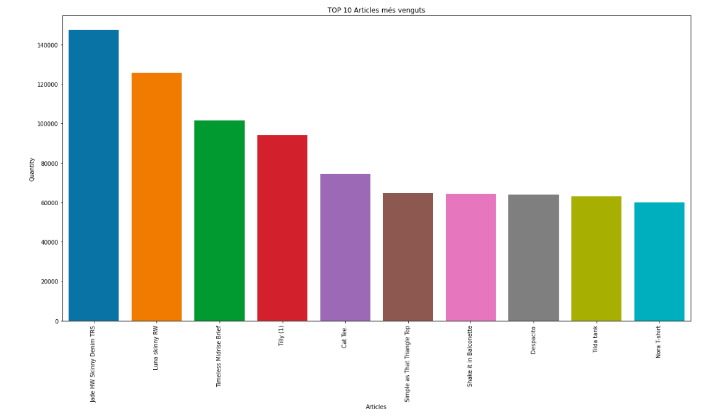
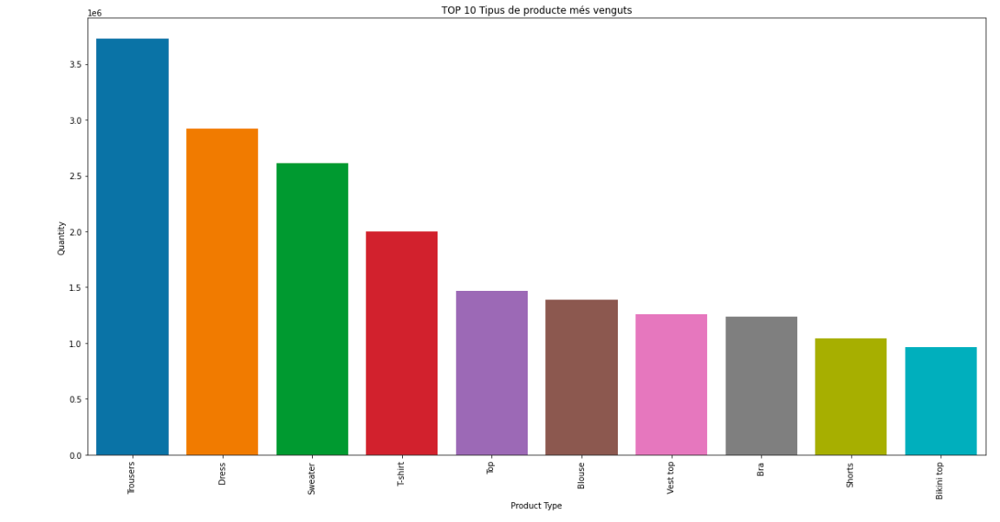
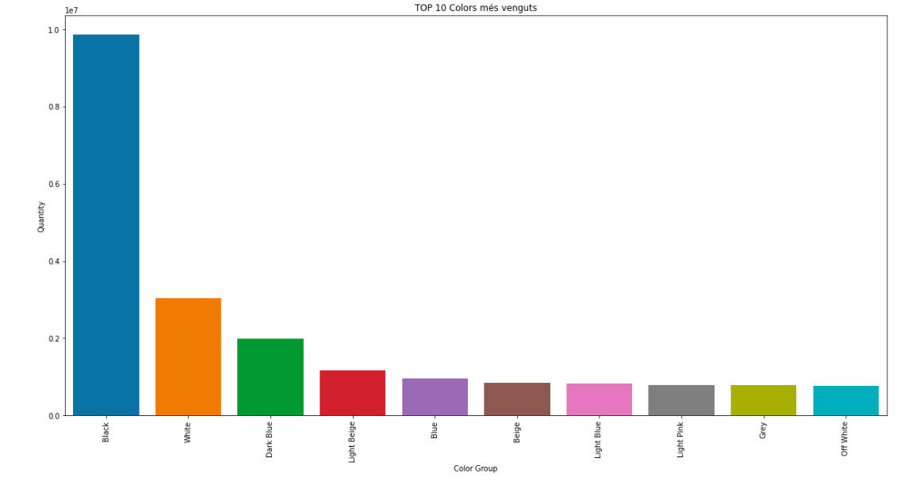

## Relacions
En aquest apartat observem alguna relació interessant que ens aporta el fet d'estudiar de manera conjunta els conjunts de dades.

### Articles i transaccions
Veiem gràficament les observacions més interessants de l'estudi conjunt dels datasets d'articles i transaccions. 

En primer lloc, representem quins són els 10 articles més venguts:

A continucació, quins són els tipus de productes més venguts:

Finalment, quins són els colors més venguts:

### Clients i transaccions
Pel que fa a l'estudi conjunt dels datasets de clients i transaccions, les observacions que considerem més significatives són les següents:
- Més del 97% de les transaccions estan realitzades per clients que són socis del club H&M. 
- Aproximadament un 42% de les compres estan realitzades per clients que reben comunicació de les revistes de moda.
