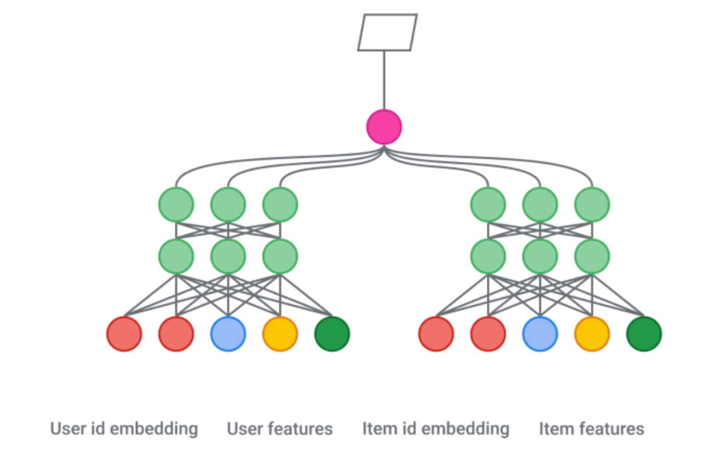
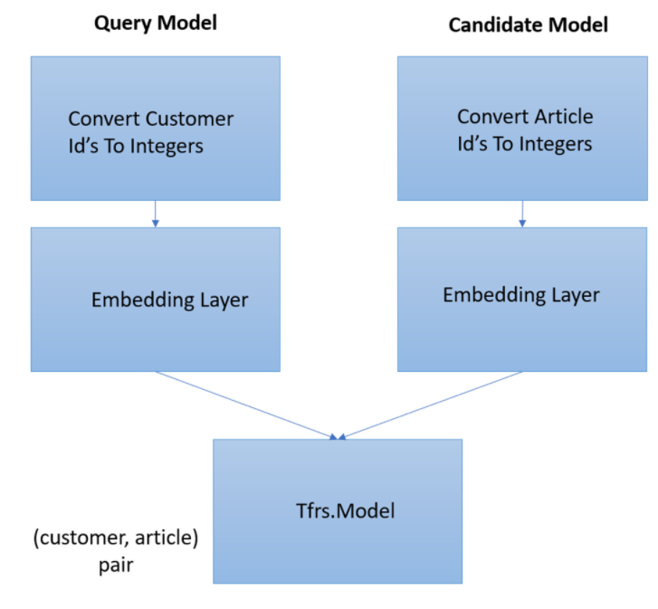

# Model 
{: .fs-9 }

L'objectiu del model és recomanar productes de H&M als seus clients. És a dir, donat un conjunt d'observacions usuari-article, proporcionar un ranking adequat per cada usuari.
Per fer-ho, utilitzarem la llibreria de **TensorFlow Recommenders (TFRS)**, que permet crear models de sistemes de recomanació.


En general, els sistemes de recomanació consten de dues fases:

•	**Retrieval Stage**: en aquesta etapa es crea un model amb el qual s'obté un conjunt inicial de centenars de candidats, d'entre tots els candidats possibles. L'objectiu principal del model és eliminar de manera eficient tots els candidats pels quals l'usuari no estigui interessat.
Els Retrieval Models normalment consten de dos sub-models: 
-	*Query Model*: per les dades de consulta 
-	*Candidate Model*: per les dades candidates

Construirem i entrenarem un model de dues torres o dos submodels (torre de consultes i torre candidata) utilitzant el conjunt de dades explicat anteriorment
Per implementar-ho, utilitzarem els mòduls de TensorFlow següents: tfrs.tasks.Retrieval i tfrs.metrics.FactorizedTopK

•	**Ranking Stage**: en aquesta etapa s'analitzen les sortides del Retrieval Model i s'afinen per seleccionar el millor conjunt de recomanacions. És a dir, l'objectiu principal d'aquesta fase és reduir el conjunt d'elements que poden interessar a l'usuari.
En aquest cas, per recuperar els millors candidats d'una consulta determinada, utilitzarem la llibreria de TensorFlow ScaNN. En concret, per cada usuari, recuperarem 12 etiquetes, que es corresponen als articles previstos que un client pot comprar en els següents 7 dies.

En aquest model, utilitzarem el dataset de “transactions”. Aquest dataset el tractem i el dividim en dos conjunts de test i train.

En un sistema de recomanació, una bona manera de dividir-lo és en un moment indicat T. És a dir, les dades fins al moment T s'utilitzen per predir les següents observacions. El nostre T es 2020-09-01.


```python
  transactions_train = transactions[transactions['t_dat'] <= '2020-09-01']
  transactions_test = transactions[transactions['t_dat'] >'2020-09-01']
```

A continuació, busquem els clients i els articles únics presents dels datatset *customers* i *articles* . És important que tant els clients com els articles siguin únics perquè necessitem mapejar els valors de les variables categòriques per després utilitzar-les en el nostre model com a vectors. És a dir, necessitem un diccionari d'aquestes dues variables per crear el nostre model. Són elements vectoritzats que s'inseriran i faran servir com a referència a les capes del model

```python
  unic_customer_id = df_customer.customer_id.unique()
  unic_article_id = df_article.article_id.unique()
  article_slices = tf.data.Dataset.from_tensor_slices(dict(df_article[articles = article_slices.map(lambda x: x['article_id'])
```

## Retrival Stage
Com hem mencionat anteriorment, utilitzarem un Retrieval Model constituit per dos sub-models. Així doncs, podem crear cada model per separat (Query Model i Candidate Model) i després combinar-los en un model final.
La idea principal és el que es representa a la figura següent:



En particular, pel nostre cas:




### Query Model
Per definir el *Query Model* utilitzem les següents capes de Keras de manera seqüencial:
- *StringLookup*: és una capa de preprocessament que mapeja característiques de cadena amb índexs enters, en aquest cas ens permet convertir els ID dels clients en números enters. 
- *Embedding*: és una capa que converteix nombres enters positus en vectors densos de dimensió fixa.

Així, per crear el model:
```python
  customer_model = tf.keras.Sequential([
    tf.keras.layers.StringLookup(
        vocabulary=unic_customer_id, mask_token=None),  
    tf.keras.layers.Embedding(len(unic_customer_id) + 1, embedding_dimension)
  ])
```
Després de diferents proves, hem considerat que el millor valor de l'hiperperàmetre *embedding_dimension* és 64.

### Candidate Model
La creació del *Candidate Model* segueix el mateix procés que el *Query Model*, però utilitzant ara la llista d'ID d'articles únics:

```python
  article_model = tf.keras.Sequential([
    tf.keras.layers.StringLookup(
        vocabulary=unic_article_id, mask_token=None),
    tf.keras.layers.Embedding(len(unic_article_id) + 1, embedding_dimension)
  ])
```

Ara que ja tenim els dos submodels creats, els unifiquem per crear el model de recomanació. 

Per facilitar la creació del model, utilitzem la classe de TensorFlow Recommenders que exposa un model base (tfrs.models.Model). Aquest model base s'encarrega de crear el cicle d'entrenament apropiat per tal que es vagi ajustant. De manera que només cal configurar els components en el mètode *__init__* i implementar el mètode **compute_loss**.

```python   
class RetrivalModel(tfrs.Model): 

    def __init__(self, customer_model, article_model):
        super().__init__()
        self.article_model: tf.keras.Model = article_model
        self.customer_model: tf.keras.Model = customer_model
        self.task = tfrs.tasks.Retrieval(
            metrics=tfrs.metrics.FactorizedTopK(
              candidates=articles.batch(128).map(self.article_model),            
            ),
        )        

    def compute_loss(self, features: Dict[str, tf.Tensor], training=False) -> tf.Tensor:
    
        customer_embeddings = self.customer_model(features["customer_id"])    
        article_embeddings = self.article_model(features["article_id"])

        # Task calcula la pèrdua i les mètriques
        return self.task(customer_embeddings, article_embeddings,compute_metrics=not training)
```

Observem que hem utilitzat *FactorizedTopK* com a mètrica. El que fa es calcular les mètriques dels K candidats principals que apareixen mitjançant un *Retrieval model*. En particular, s'utilitza la mètrica predeterminada que *top K categorical accuracy* (màxima precisió categòrica K), és a dir, calcula amb quina freqüència el candidat veritable es troba entre els K candidats principals per a una consulta determinada.

Finalment, amb el model ja definit, podem ajustar i avaluar el model utilitzant les crides estàndard de Keras:

```python
  model = RetrivalModel(customer_model, article_model)
  model.compile(optimizer=tf.keras.optimizers.Adagrad(learning_rate=0.1))
```

Observem que hem utilitzat l'optimitzador *Adagrad* amb un *learning rate* de 0.1 (també després de provar diferents opcions d'aquests).

L'optimitzador *Adagrad* (Algorisme de Gradient Adaptatiu) es defeinex com és una modificació de l'*Stochastic Gradient Descent* on s'utilitzen diferents taxes d'aprenentatge per a les variables tenint en compte gradient acumulat en cadascuna.

Amb el model definit, l'entrenem. Per fer-ho hem el valor de 5 l'hiperparàmetre *epoch* (iteracions del cicle complet d'entrenament)

```python
history = model.fit(
    train_ds,    
    epochs=5,
    verbose=1)
```

## Ranking Stage
En aquesta fase, com hem explicat al principi s'analitzen les sortides del Retrieval Model i s'afinen per seleccionar el millor conjunt de recomanacions. En aquest cas, per recuperar els millors candidats d'una consulta determinada, utilitzarem la llibreria de TensorFlow *ScaNN*. En concret, per cada usuari, recuperarem 12 etiquetes, que es corresponen als articles previstos que un client pot comprar en els següents 7 dies.

```python
scann_index = tfrs.layers.factorized_top_k.ScaNN(model.customer_model, k = 12 )
scann_index.index_from_dataset(
  tf.data.Dataset.zip((articles.batch(100), articles.batch(100).map(model.article_model)))
)
```

*ScanNN()* és una funció s'utilitza per recuperar els millors candidats d'una consulta determinada.
